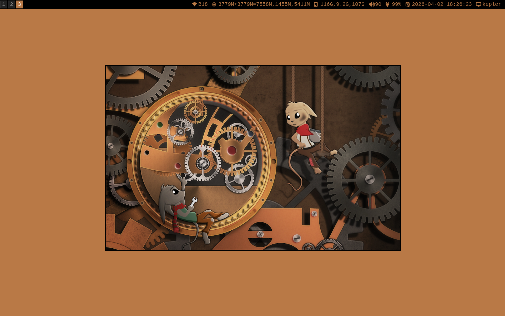

# kepler-dotfiles

"kepler" is a hostname for my Fujitsu ArrowTab device, the name is taken from NASA's discovered exoplanet named "Kepler-22b".

Although, the color scheme and theme in my i3 environment doesn't resemble a "Kepler" exoplanet at all.

Color scheme and theme is inspired by well-known version of Damn Small Linux, with a recreation of its original wallpaper.

# Wallpaper

Original: [https://www.deviantart.com/gpedde/art/Maintenance-165229479](https://www.deviantart.com/gpedde/art/Maintenance-165229479)
